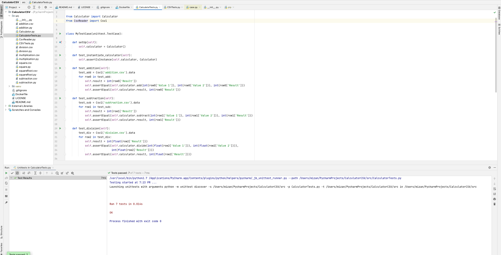
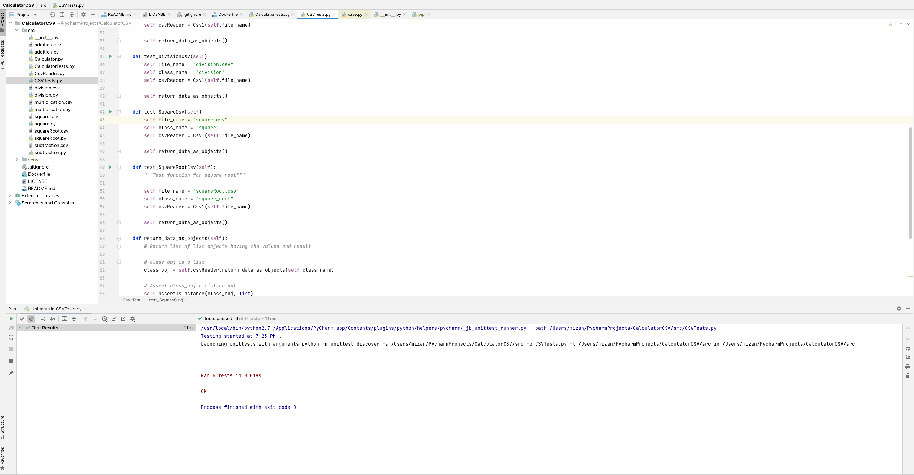

#CalculatorCSV

#Individual Project: Create a Calculator- Individual

Due Mar 22 by 11:59pm Points 5 Submitting a website URL or a file upload

For this project you need to create a calculator using Python that has automated unit tests. Your calculator is required to perform the following operations: addition, subtraction, multiplication, division, square, and square root. You need to correctly use static methods, object methods, object attributes / properties. You need to use the included files to load data for your unit tests. Use each file to test the associated operation.

You need to make at least 7 unit tests and should develop your tests as you write the program. For example, you should test object instantiation when you write the code to create the object. You must not repeat code and will lose points for any code repetition. You should try to make a commit for each successful step you take writing the program and include a unit test with that step.

#Screenshots - Calculator

#Screenshots - CSV

#Requirements:

Correct usage of object and static methods and properties

At least 7 unit tests

At least 7 commits

Your program works

Your docker file is setup to run the program

#Files:

Unit Test Addition.csvPreview the document

Unit Test Subtraction.csvPreview the document

Unit Test Multiplication.csvPreview the document

Unit Test Division.csvPreview the document

Unit Test Square.csvPreview the document

Unit Test Square Root.csvPreview the document